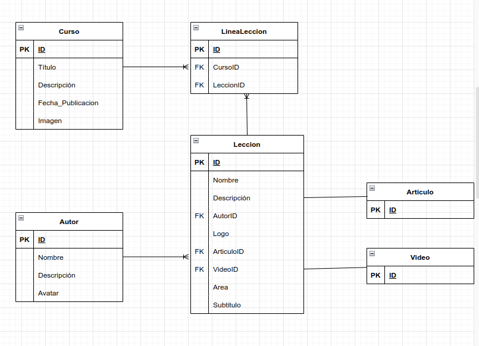

# Bootcamp Backend - Laboratorio - .NET - Modulo 1 - Modelado

## Diagrama del modelo de datos:

Una startup tecnológica va a desarrollar un portal de ELearning y nos ha pedido que realizamos el modelo de datos de dicho sistema.

A tener en cuenta:

- Va a ser un portal orientado al mundo de la programación.
- El portal va a estar compuesto por cursos, cada curso está compuesto a su vez por un número de videos y artículos que lo acompañen.
- Los videos y el contenido de cada artículo se almacenan en un storage S3 y en un headless CMS, en la base de datos sólo almacenaremos los Id's a esos recursos.
- Los videos se puede clasificar por temáticas (Devops / Front End / Back End / ...)
- Los videos tienen autores (ponemos la restricción, un video tiene un autor), un curso puede tener varios autores.

Desde mi punto de vista, el modelado de la aplicación solicitada se basa fundamentealmente en 2 tablas. 

    + La tabla **Curso**, donde se guarda la información de cada uno de los cursos ofertados por el portal ELearning. A su vez cada curso está formado por una serie de articulos y videos. Para ello englobo todo ello en una segunda tabla llamada **Leccion**.

    + La relación de curso a lección la he representado como una relación de muchos a muchos, ya que a un curso puede tener muchas lecciones, y una leccion puede pertenecer a varios cursos. Por tanto, en el modelo relacional, necesito una tabla intermedia para realizar dicha relacion, la tabla **Linea Leccion**, donde a parte del ID de dicha linea, guardo una FK de cada una de las tablas que une, CursoID y LeccionID.

    + Una lección, a parte de informacion como 'nombre','area' o 'logo', está formado por un video y un artículo asociados. Por lo tanto en la tabla debo meter dos FK (articuloID y videoID), para consumir en su momento, el video y el articulo asociado a dicha lección. Como en el enunciado se me dice que el contenido de ambos se guarda aparte, solo almacenamos sus Ids.

    + Por último, cada lección pertenece a un solo Autor, pero un Autor puede haber realizado mas de una leccion, por lo tanto la relación entre la tabla leccion y autor es una relación de uno a muchos. En la tabla lección tambien creo una FK AutorID para enlazar las tablas.

### Parte obligatoria

- Queremos mostrar los últimos cursos publicados:
    Para ello accedemos a la tabla Curso y filtramos por fecha de publicación.
- Queremos mostrar cursos por área (devops / front End ...):
    Filtramos en la tabla leccion por 'Area' y mediante la tabla LineaLeccion, sacamos los Cursos a los que pertenecen esas lecciones.
- Queremos mostrar un curso con sus videos:
    Tenemos un curso seleccionado, a traves de la tabala LineaLeccion, sacamos todos las lecciones para dicho curso.
- En un video queremos mostrar su autor:
    Para un video seleccionado, a través de su ID, buscamos en la tabla Leccion ID = videoID y sacamos el autor de esa leccion (AutorID).

